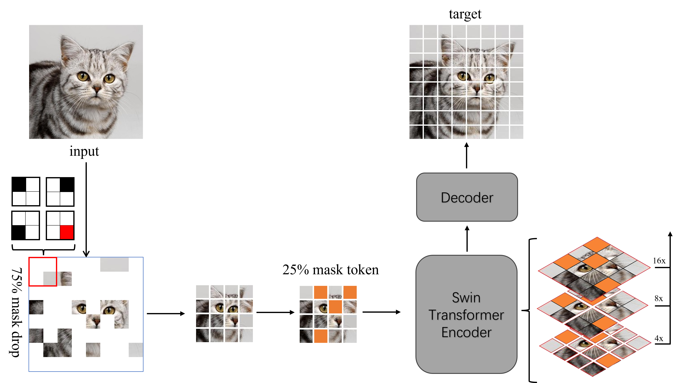
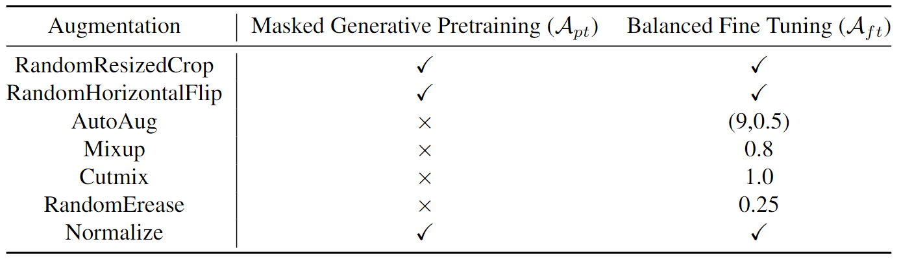

# Hierarchical Masked Autoencoding Synergy with Swin Transformer for Enhanced Long-Tailed Visual Recognition


&nbsp;

<p align="center">

</p>

&nbsp;

## Environments

```shell
python == 3.7
pytorch >= 1.7.0
torchvision >= 0.8.1
timm == 0.3.2
tensorboardX >= 2.1
```

1. We recommand to install `PyTorch 1.7.0+`, `torchvision 0.8.1+` and `pytorch-image-models 0.3.2`.
2. If your PyTorch is 1.8.1+, a [fix](https://github.com/huggingface/pytorch-image-models/issues/420) is needed to work with timm.
3. See `requirements.txt` for detailed requirements. You don't have to be in strict agreement with it, just for reference.


## Data preparation

We adopt `torchvision.datasets.ImageFolder` to build our dataloaders. Hence, we resort all datasets (ImageNet-LT, iNat18, Places-LT, CIFAR) as follows:

```shell
/path/to/ImageNet-LT/
    train/
        class1/
            img1.jpeg
        class2/
            img2.jpeg
    val/
        class1/
            img3.jpeg
        class2/
            img4.jpeg
```

You can follow the `prepare.py` to construct your dataset.


## Usage

1. Please set the **DATA_PATH** and **WORK_PATH** in `util.trainer.py` Line 6-7.

2. Typically, make sure 4 or 8 GPUs and >12GB per GPU Memory are available.

3. Keep the settings consistent with the follows.

&nbsp;

<p align="center">

</p>

&nbsp;&nbsp;


You can see all args in Class `Trainer` in `util/trainer.py`. 

Specially, for different stage, the commands are:

```python
# MGP stage
python script/pretrain.py
# BFT stage
python script/finetune.py
# evaluate stage
python script/evaluate.py
```


## Results and Models

Balanced Finetuned Models and Masked Generative Pretrained Models.

<table class="tg">
<thead>
  <tr>
    <th class="tg-nrix">Dataset</th>
    <th class="tg-nrix">Resolution</th>
    <th class="tg-nrix">Many</th>
    <th class="tg-nrix">Med.</th>
    <th class="tg-nrix">Few</th>
    <th class="tg-nrix">Acc</th>
  </tr>
</thead>
<tbody> 
  <tr>
    <td class="tg-57iy">ImageNet-LT</td>
    <td class="tg-57iy">256*256</td>
    <td class="tg-57iy">76.6</td>
    <td class="tg-57iy">61.5</td>
    <td class="tg-57iy">42.3</td>
    <td class="tg-57iy">64.7</td>

    </tr>
  <tr>
    <td class="tg-57iy">iNat18</td>
    <td class="tg-57iy">224*224</td>
    <td class="tg-57iy">77.7</td>
    <td class="tg-57iy">78.6</td>
    <td class="tg-57iy">78.8</td>
    <td class="tg-57iy">78.6</td>
    
  </tr>
  <tr>
    <td class="tg-nrix">Places-LT</td>
    <td class="tg-nrix">256*256</td>
    <td class="tg-nrix">45.7</td>
    <td class="tg-nrix">37.8</td>
    <td class="tg-nrix">26.5</td>
    <td class="tg-nrix">38.4</td>

  </tr>
</tbody>
</table>


## Acknowledgements

This project is highly based on [DeiT](https://github.com/facebookresearch/deit) and [MAE](https://github.com/facebookresearch/mae).
